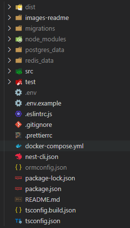
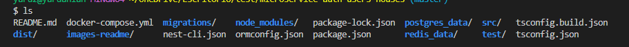
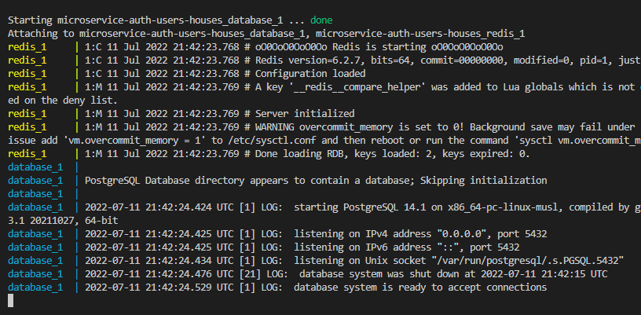

<p align="center">
  <a href="http://nestjs.com/" target="blank"></a>
</p>

[circleci-image]: https://img.shields.io/circleci/build/github/nestjs/nest/master?token=abc123def456
[circleci-url]: https://circleci.com/gh/nestjs/nest

  <p align="center">A progressive <a href="http://nodejs.org" target="_blank">Node.js</a> framework for building efficient and scalable server-side applications.</p>
    <p align="center">
<a href="https://www.npmjs.com/~nestjscore" target="_blank"></a>
<a href="https://www.npmjs.com/~nestjscore" target="_blank"></a>
<a href="https://www.npmjs.com/~nestjscore" target="_blank"></a>
<a href="https://circleci.com/gh/nestjs/nest" target="_blank"></a>
<a href="https://coveralls.io/github/nestjs/nest?branch=master" target="_blank"></a>
<a href="https://discord.gg/G7Qnnhy" target="_blank"></a>
<a href="https://opencollective.com/nest#backer" target="_blank"></a>
<a href="https://opencollective.com/nest#sponsor" target="_blank"></a>
  <a href="https://paypal.me/kamilmysliwiec" target="_blank"></a>
    <a href="https://opencollective.com/nest#sponsor"  target="_blank"></a>
  <a href="https://twitter.com/nestframework" target="_blank"></a>
</p>
  <!--[](https://opencollective.com/nest#backer)
  [](https://opencollective.com/nest#sponsor)-->

## Description

[Nest](https://github.com/nestjs/nest) framework TypeScript starter repository.

## Installation

```bash
$ npm install
```

## Running the app

```bash
# development
$ npm run start

# watch mode
$ npm run start:dev

# production mode
$ npm run start:prod
```

## Test

```bash
# unit tests
$ npm run test

# e2e tests
$ npm run test:e2e

# test coverage
$ npm run test:cov
```

## Support

## Instrucciones
Este apartado se encuentra en español con fines de plasmar las ideas de manera clara. Cabe destacar que se hace muestra del .env y demas archivos ignorados con fines didacticos.

**NOTA: para poder utilizar la validacion de codigos de descuento se debe hacer pull y ejecucion del siguiente repositorio: https://github.com/johann2912/B--microservice-discounts  debido a que este microservicio es el encargado de los codigos de descuento**


### Observamos la estructura base del proyecto:



Procederemos a crear los archivos de ormconfig.json (el cual es necesario para poder ejecutar migraciones) y el archivo .env donde se encuentras nuestras variables de entorno.
Antes de realizar la creacion de los archvios de debe tener instalado docker en tu computadora para poder hacer ejecucion del docker compose donde pondremos a correr nuestra base de datos. una vez tengamos realizado esto esto hacemos los siguiente; utilizamos una nueva consola y nos situamos en la raíz de nuestro proyecto una vez nos encontremos al nivel de docker compose.



procedemos a ejecutar el comando:
```bash
docker-compose up
```
y observaremos como se instala la imagen de postgres y redis (este caso implementamos redis para manejar la persistencia de datos de los tokens de session) se levanta la base datos.




```bash
# ormconfig.json
{
    "type": "postgres",
    "host": "localhost",
    "port": 5432,
    "username": "postgres",
    "password": "qwesaR123",
    "database": "booking_houses",
    "synchronize": false,
    "entities": [
        "src/frameworks/pg/entities/**/*.entity{.ts, .js}"
    ],
    "migrationsTableName": "custom_migration_table",
    "migrations": [
        "./migrations/*.{js,ts}"
    ],
    "cli": {
        "migrationsDir": "./migrations/"
    }
}
```

```bash
# PORJECT PORT
PORT=4000

# SWAGGER
SWAGGER_PASS=QWFqq12211io

# DATABASE CREDENTIALS
PGHOST=localhost
PGPORT=5432
PGUSER=postgres
PGPASSWORD=qwesaR123
PGDATABASE=booking_houses

# JSONWEBTOKEN
JWT_ACCESS_KEY=cvtyxcqtx1vt2323*+1!
JWT_REFRESH_KEY=opsaPiasd13331/qw*

# REDIS
REDIS_HOST=127.0.0.1
REDIS_PORT=6379
REDIS_PASSWORD=MDNcVb924a

# SERVICE EXTERNALS
DISCOUNT_VALIDATE=http://localhost:4001/api/v1/discount/docs/discount-code/code-expired/{code}?code=
```

```bash
# En nuestra consola para poder ejecutar mirgaciones primero debomos generarla y luego ejecutarla

# genera migracion
migration:generate
$ npm run migration:generate nombre-migracion

# ejecutar migracion
migration:run
$ npm run migration:run
```
cuando se ejecute el ultimo comando se creara en la raíz de nuestro proyecto una carpeta llamada migrations. **NOTA: antes de ejecutar una migracion creada debemos ingresa al archivo de la migracion y hacer un guardado de este en mi caso es ctrl + s**

## swagger
la documentacion de swagger la encontramos en la siguiente ruta -> http://localhost:4000/api/v1/auth-users-houses/docs
